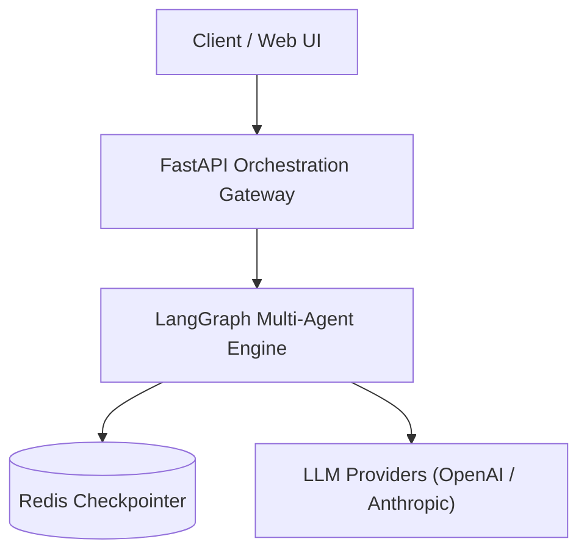

# System Architecture Document — AgenticFlow AI

**Project Name:** AgenticFlow AI  
**Author:** Nachiket Gadilohar  

---

## 1. System Architecture Diagram

```mermaid
graph TB
    Client["Client / Web UI"] --> API["FastAPI Orchestration Gateway"]
    API --> LangGraph["LangGraph Multi-Agent Engine"]
    LangGraph --> Redis[("Redis Checkpointer")]
    LangGraph --> LLMs["LLM Providers (OpenAI / Anthropic)"]
```
